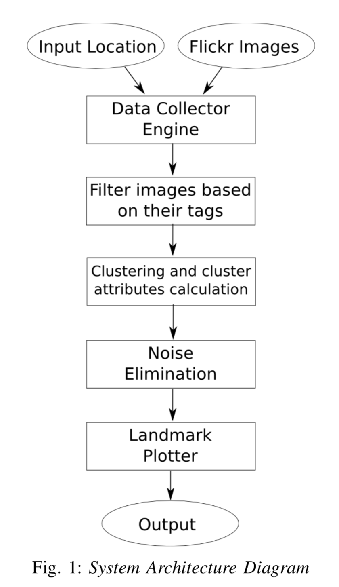
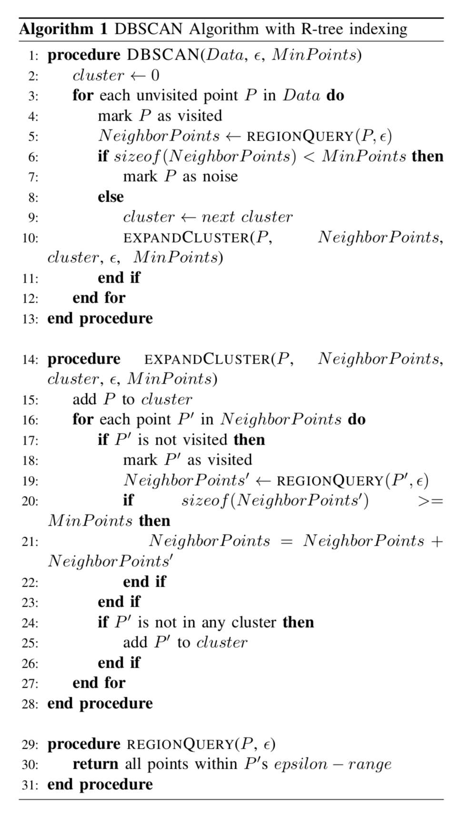
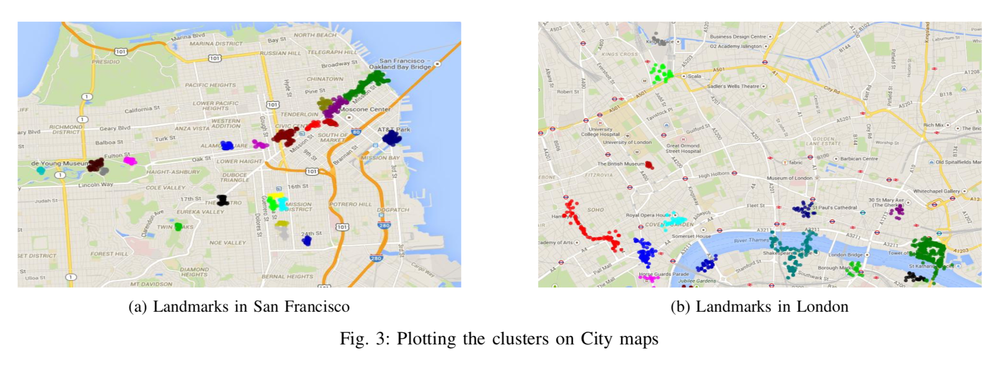

# TravelRouteRecommendation

Major Contributor : https://github.com/dodo9396

The details of the project is published here : https://www.semanticscholar.org/paper/A-spatial-clustering-approach-for-efficient-using-Deeksha-Ashrith/a3b210aaafc4dc011e2125248f8db4cca6e268a6?tab=abstract

A web application that suggests an optimal route between A and B such that multiple tourist attractions are present on the journey from A to B, finding a middle ground between shortest route and a route which includes maximum tourist attractions.

System overview : 

